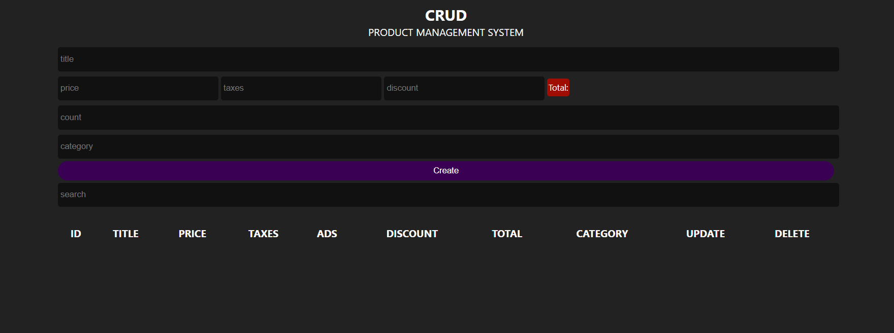

# Product Management System (CRUD) 🛒

نظام متكامل لإدارة المنتجات يوفّر جميع عمليات **CRUD**  
(Create – Read – Update – Delete) مع واجهة بسيطة وسهلة الاستخدام.  
يساعد المستخدم على إضافة المنتجات، تعديلها، البحث عنها، وحذفها مع حفظ البيانات محليًا باستخدام **Local Storage**.

---

## 🔗 Live Demo  
👉 https://cruds-brown.vercel.app/

## 🗂️ GitHub Repository  
👉 https://github.com/ahmed-moatemed/pro-for-prodect

---

## 📸 Preview  




---

## 🚀 Features
- إضافة منتجات جديدة (Create)  
- عرض جميع المنتجات (Read)  
- تعديل بيانات المنتجات (Update)  
- حذف منتج واحد أو جميع المنتجات (Delete All)  
- البحث عن المنتجات بالاسم أو الفئة  
- التحقق من صحة البيانات قبل الإضافة  
- حفظ البيانات باستخدام **Local Storage**  
- واجهة بسيطة وسهلة الاستخدام  
- Responsive Design يعمل على مختلف الأجهزة

---

## 🛠️ Technologies Used
- **HTML5**  
- **CSS3**  
- **JavaScript (ES6+)**  
- **Local Storage**  
- **Responsive Design**

---

## 📦 Installation & Run Locally

```bash
# Clone repository
git clone https://github.com/ahmed-moatemed/pro-for-prodect.git

# Open project folder
cd pro-for-prodect

# Run the project
Open index.html in your browser
```

---

## 📝 Notes
- جميع البيانات يتم حفظها في Local Storage داخل المتصفح.  
- يمكن تطوير المشروع بإضافة:
  - تصنيف المنتجات  
  - نظام مستخدمين (Login / Roles)  
  - تصدير البيانات (CSV / Excel)  
  - Dashboard بإحصائيات  
  - ربط المشروع بقاعدة بيانات حقيقية  

---

## ✨ Author
Developed by **Ahmed Ibrahim Moatemed**  
📧 Email: matamedahmed@gmail.com  
🔗 Portfolio: https://mo3temed.netlify.app/
